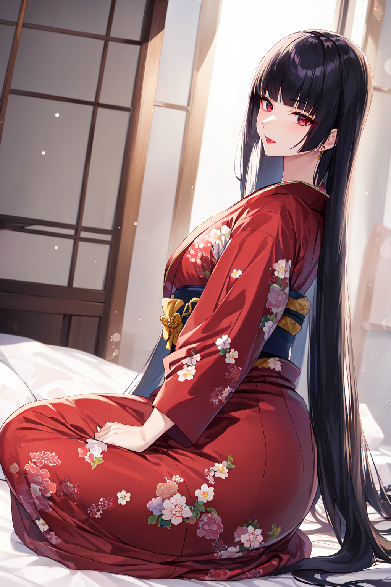
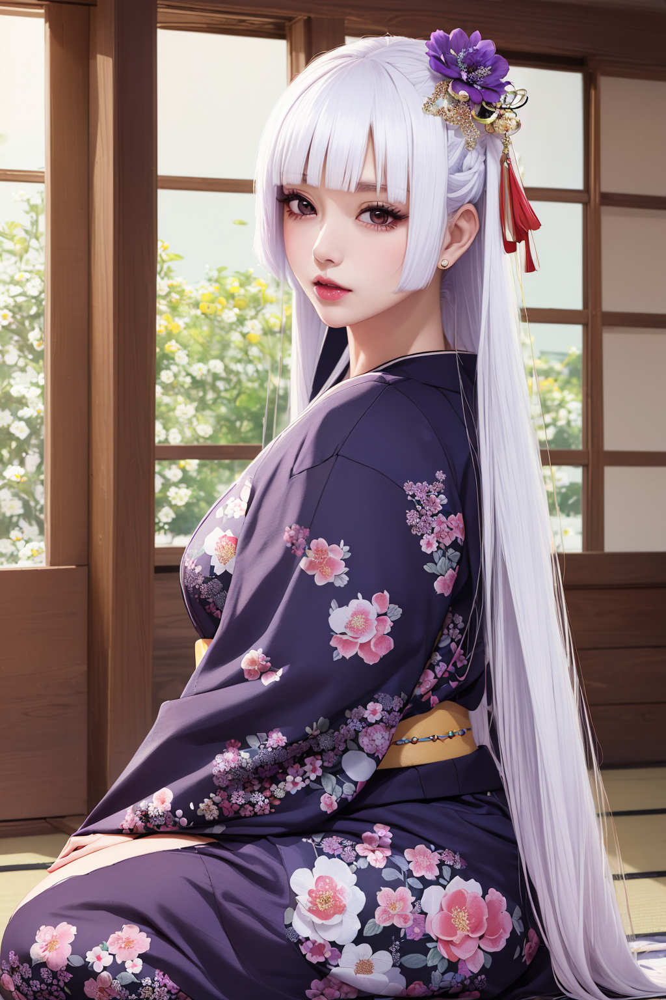

# LoRA - Hime Style Hair

Open-sourced LoRA configuration and training data for Stable Diffusion 1.5.

| `AnythingV5V3_v5PrtRE`                       | `perfectWorld_v4Baked`                              |
|---------------------------------|----------------------------------------------|
|  |  |

_Ara ara~_

"Hime-style", "yamato nadeshiko", "the wallflower". The look may have many names, but it's an iconic Japanese style.
Very long, straight hair with blunted bangs and a hime cut at the front. Often found cascading over the shoulders or body, or gathering into silky pools on the floor.

Trained on NAI.

https://civitai.com/models/120969/sliced-bob-hairstyle

## Parameters

Recommended weight: `0.8`

Activation tags: `hime style`

Secondary tags: `straight hair`, `hime cut`, `blunted bangs`, `cascading hair`, `draped hair`, `flowing hair`

## Version History

| `XYZ0`                | `XYZ1`                |
|-----------------------|-----------------------|
|  |  |

#### v1.0

* Release

## Training

* Load config into [Kohya SS](https://github.com/bmaltais/kohya_ss)
* Download a base model. I use a custom mix that I created called [f3e - Forge](https://civitai.com/models/160315)
* Download or create regularization images for the chosen model.
  For Forge use [reg-f3e-1girl](https://github.com/n15g/reg-f3e-1girl).
* Update paths for the model, image, output and logging folders
* Adjust the batch size for your GPU

| VRAM       | 24 GiB | 12 GiB | 8GiB |
|------------|--------|--------|------|
| Batch Size | 10     | 4      | 2-3  |
